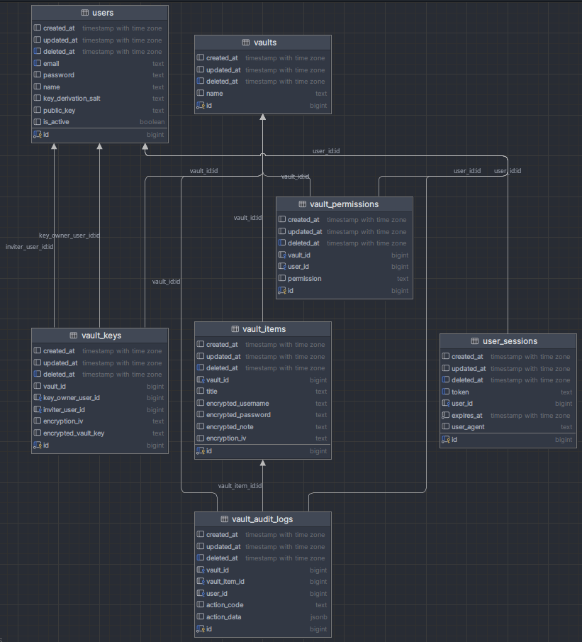

# LetusPass

- [LetusPass](#letuspass)
  - [Features](#features)
  - [Demo](#demo)
  - [Try on your local machine](#try-on-your-local-machine)
  - [Database ERD](#database-erd)
  - [Encryption System](#encryption-system)

 

LetusPass is a password manager application for teams or personal use. The name is
derived from "Let us pass".

**Backend stack:** [Go](https://go.dev/), [Gin](https://github.com/gin-gonic/gin),
[Gorm](https://github.com/go-gorm/gorm), [PostgreSQL](https://www.postgresql.org/),
[swaggo/swag](https://github.com/swaggo/swag), [zerolog](https://github.com/rs/zerolog)  
**Frontend stack:** [React](https://react.dev/), [Mantine](https://mantine.dev/), [React
Router](https://reactrouter.com/), [Redux](https://redux.js.org/), [React
Query](https://tanstack.com/query/latest/docs/framework/react/overview),
[Axios](https://github.com/axios/axios), [Orval](https://github.com/orval-labs/orval)

## Features
- End-to-end encryption
  - Every encryption and decryption is done on the client side. The server never
  sees saved credentials in unencrypted form.
- Shareble/Collabrative vaults
- Vault audit logs
- Permission management
- Mobile friendly UI
- OpenAPI/Swagger documentation
- Structured json logging

## Demo

Watch demo video on YouTube:

## Try on your local machine 

Simply just run `docker compose up` in the root directory.

The application will be available at `http://localhost:3000`.

You can access the OpenAPI documentation at `http://localhost:8080/swagger/index.html`.

You can stop the application with `Ctrl+C` and remove the containers using `docker compose down`
command.

## Database ERD

  

## Encryption System

Every user has a private and a public key which derived from the user's password
and a salt. Public keys are uploaded to the server where other users can retrieve.

Every vault has a vault key which is used to encrypt and decrypt the vault items.
Vault keys are stored in encrypted form in the database. Vault keys need to be
decrypted before use. Decryption is done on the client side as well.

To understand how encryption and decryption work in the application, you can study below
graphs and flows. They only includes parts related to encryption/decryption
(permission management, audit logging, error handling, etc. are not included).

  
Cryptography Related ERD

  

    
  

  
Register Flow

  
  

    
  

  
Login Flow

  
  

    
  

  
Create Vault Flow

  
  

    
  

  
Get Raw Vault Key Flow

  
  

    
  

  
Add User to Vault Flow

  
  

    
  

  
Add New Vault Item to Vault Flow

  
  

    
  

  
Retrieve a Vault Item Flow

  
  

    
  

  
Update a Vault Item Flow

  
  

    
  

---

Backend documentation at [backend/](./backend/README.md)  
Frontend documentation at [frontend/](./frontend/README.md)